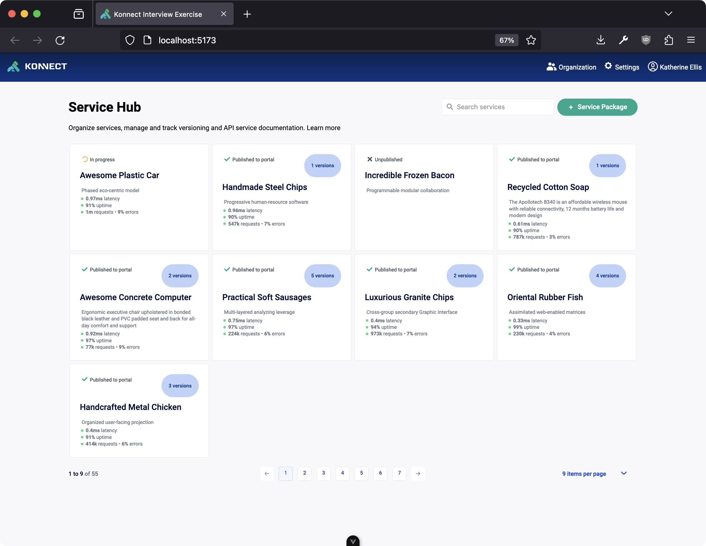

# Welcome

Hello and welcome to my submission for the Kong Konnect UI project.

## Get Started

No setup or build tooling was modified. To get started: 

1. `pnpm install`
1. `pnpm run dev:server`
1. `pnpm run dev:ui`

## Assumptions

* The Service Catalog list result is only used on this page. If it were used elsewhere, I would have moved that state into a Pinia store to be shared across the app. 
* Pagination is client-side only

## To do

- [x] List ServicePackages as cards
- [x] Search functionality
- [x] Pagination functionality
- [] Build ServiceDetails page
- [] Add Vue test setup so that Kongponents functions
- [] Replace any leftover hex colors with CSS variables
- [] Add E2E test, rather than simply testing component in isolation
- [] Break down UI elements into more re-usable and focused components
- [] Move ServiceCatalog list into Pinia store for reusable state management
- [] Rename usage of `ServiceCatalog` to `ServicePackage` to align with Kong's business entity terminology
- [] Add functionality for `Create Service Package` button